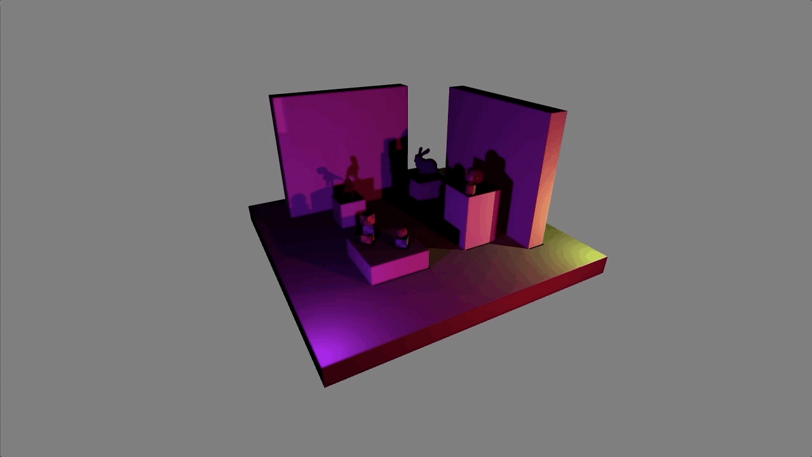

# pmtech demos

## Signed Distance Field Shadows

# pmtech basic examples

### Instancing

### Constraints

### Rigid Body Primitives

### Imgui

### Multiple Render Targets

### Render Target

### Basic Texture

### Basic Triangle

