The following demos build ontop of my framework [pmtech](https://github.com/polymonster/pmtech).

### Signed Distance Field Shadows 

### Subsurface Scattering

### Data Driven Renderer

### Data Driven Post Processing

### Dynamic Cubemap

### Vertex Stream Out

### Skinning
[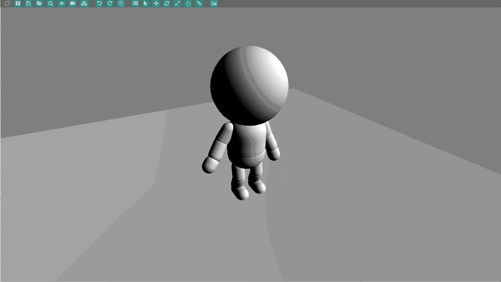](https://github.com/polymonster/pmtech/blob/master/examples/code/skinning/skinning.cpp)

### Instancing
[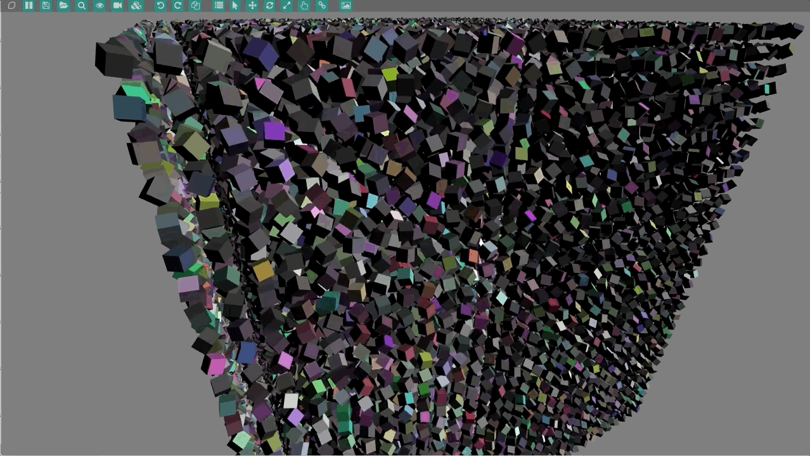](https://github.com/polymonster/pmtech/blob/master/examples/code/instancing/instancing.cpp)

### Constraints
[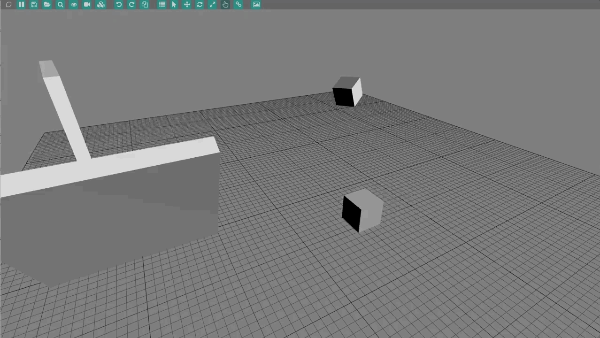](https://github.com/polymonster/pmtech/blob/master/examples/code/physics_constraints/physics_constraints.cpp)

### Rigid Body Primitives
[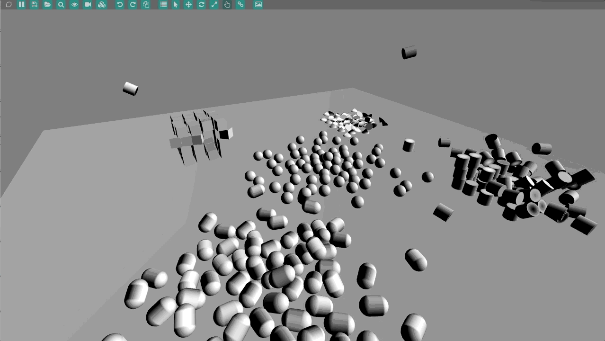](https://github.com/polymonster/pmtech/blob/master/examples/code/rigid_body_primitives/rigid_body_primitives.cpp)

### Cubemap
[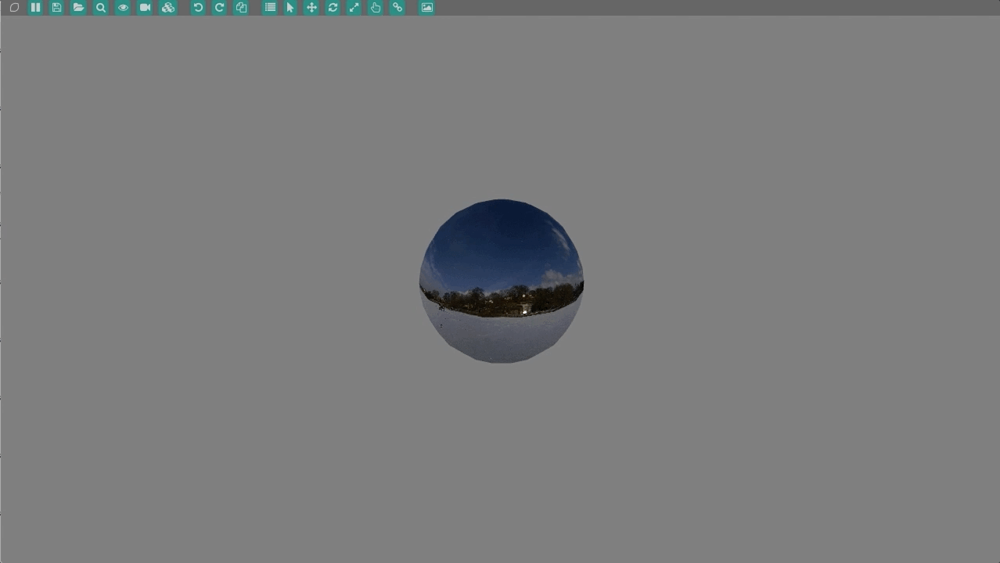](https://github.com/polymonster/pmtech/blob/master/examples/code/cubemap/cubemap.cpp)

### Shadows
[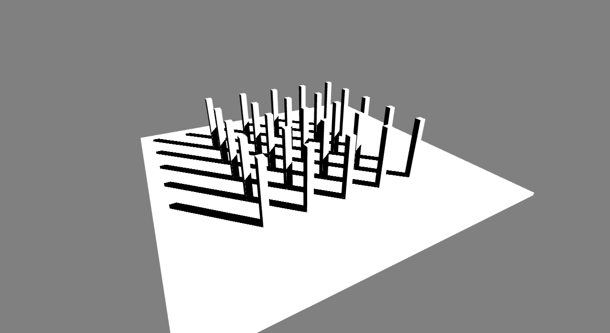](https://github.com/polymonster/pmtech/blob/master/examples/code/shadows/shadows.cpp)

### Volume Texture

### Maths Functions
[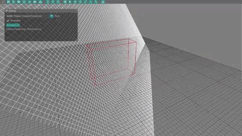](https://youtu.be/uR9lfvPL7eE)

### Audio Player
[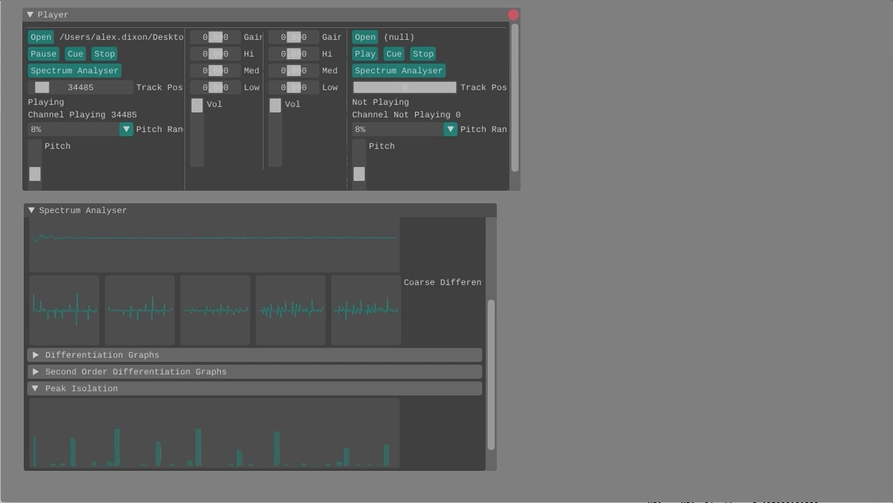](https://github.com/polymonster/pmtech/blob/master/examples/code/audio_player/audio_player.cpp)

### Texture Formats
[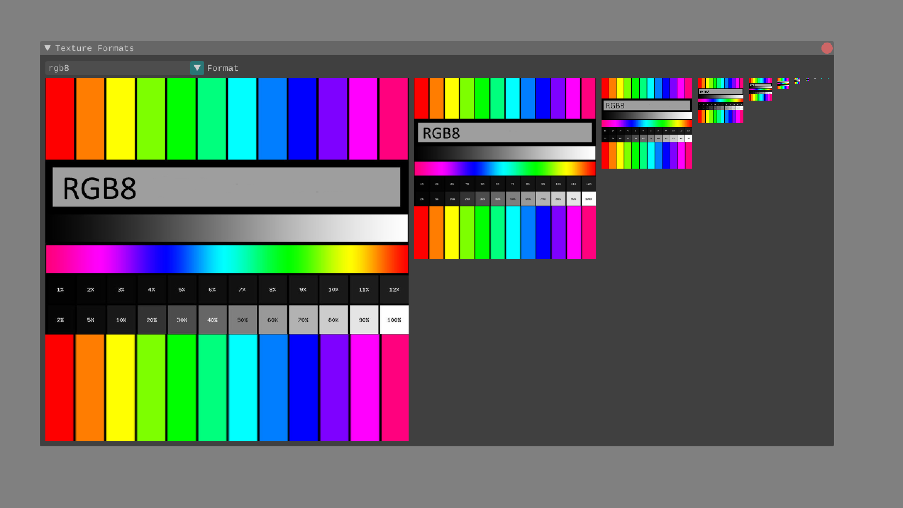](https://github.com/polymonster/pmtech/blob/master/examples/code/texture_formats/texture_formats.cpp)

### Shader Toy
[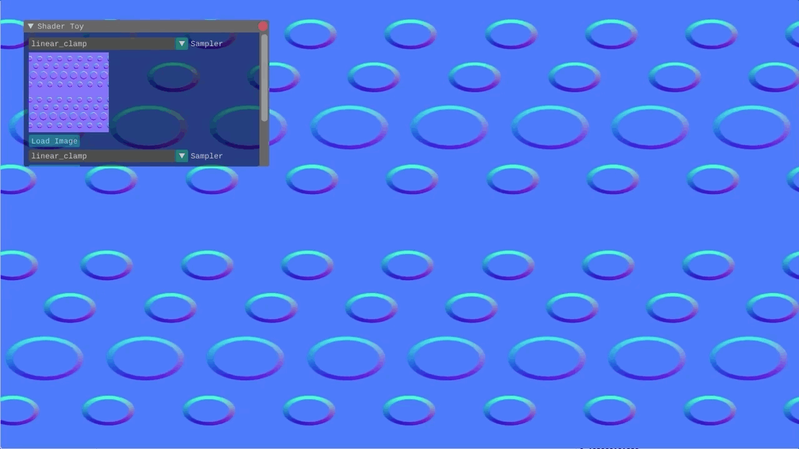](https://github.com/polymonster/pmtech/blob/master/examples/code/shader_toy/shader_toy.cpp)

### Multiple Render Targets
[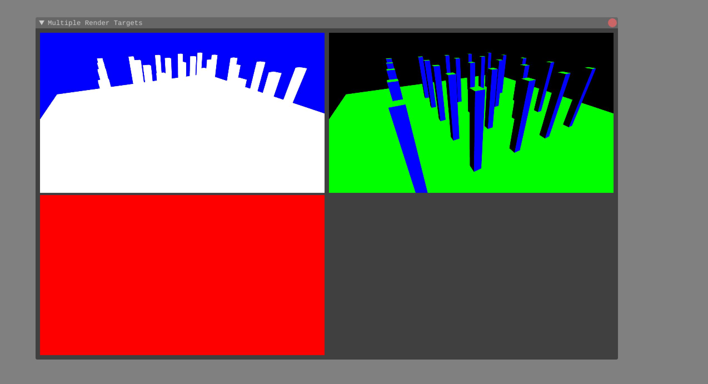](https://github.com/polymonster/pmtech/blob/master/examples/code/multiple_render_targets/multiple_render_targets.cpp)

### Blend Modes 

### Imgui
[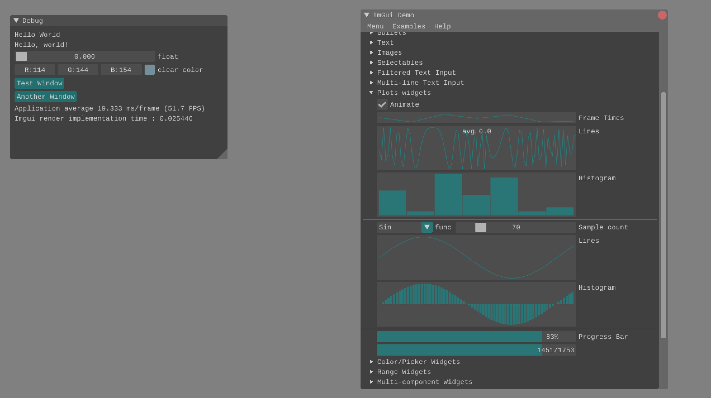](https://github.com/polymonster/pmtech/blob/master/examples/code/imgui/imgui_example.cpp)

### Input

### Debug Text

### Render Target
[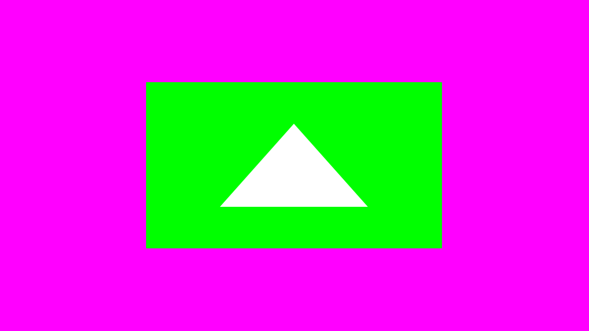](https://github.com/polymonster/pmtech/blob/master/examples/code/render_target/render_target.cpp)

### Basic Texture
[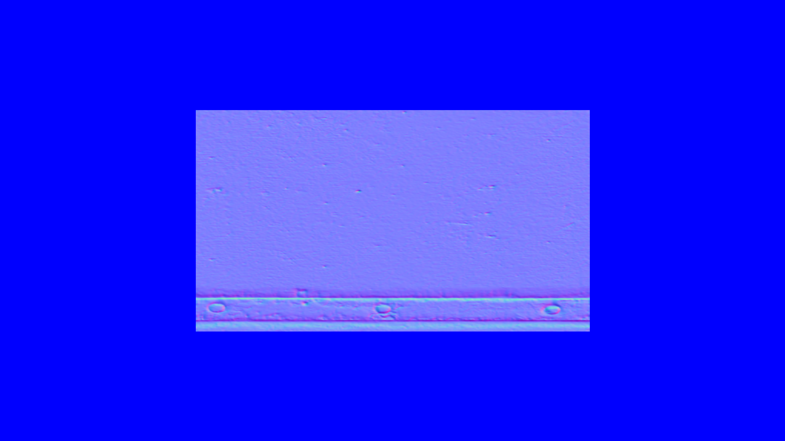](https://github.com/polymonster/pmtech/blob/master/examples/code/basic_texture/basic_texture.cpp)

### Basic Triangle
[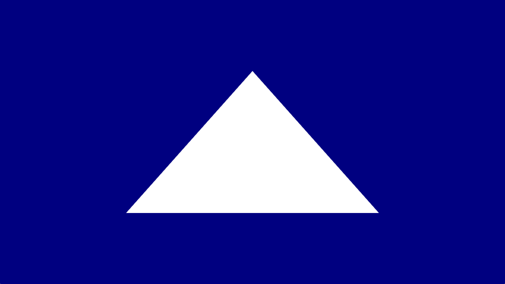](https://github.com/polymonster/pmtech/blob/master/examples/code/basic_triangle/basic_triangle.cpp)

<iframe width="640" height="360" frameborder="0" src="https://www.shadertoy.com/embed/WdB3Wd?gui=true&t=10&paused=true&muted=false" allowfullscreen></iframe>

