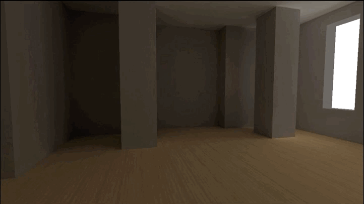
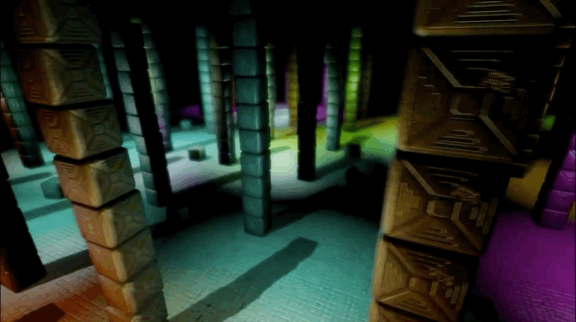

# pmtech demos

The following demos build ontop of my framework pmtech, read more about the features [here](https://polymonster.github.io/articles.html) and checkout the repository on [github](https://github.com/polymonster/pmtech)

### Signed Distance Field Shadows

### Subsurface Scattering

### Data Driven Post Processing

### Vertex Stream Out

### Skinning

### Instancing

### Constraints

### Rigid Body Primitives

### Cubemap

### Shadows

### Maths Functions

### Audio Player

### Texture Formats

### Imgui

### Shader Toy

### Multiple Render Targets

### Input

### Debug Text

### Render Target

### Basic Texture

### Basic Triangle

# Older Demos

### Radiosity

### Deferred Rendering / Post Processing

### Cascaded Shadow Maps

### Antechamber

